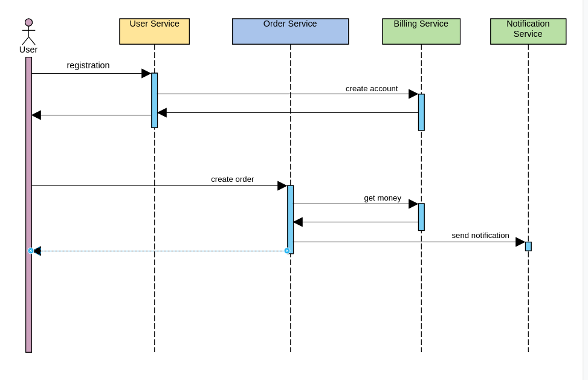

Подготовка
1. minikube start
2. minikube addons enable ingress
3. kubectl apply -f ./namespaces.yaml
4. kubectl apply -f ./kafka/kafka-crd.yaml -n apps
5. kubectl apply -f ./kafka/kafka-persistent-single.yaml -n apps
6. kubectl apply -f ./deploy

Запустить тесты из postman.json

